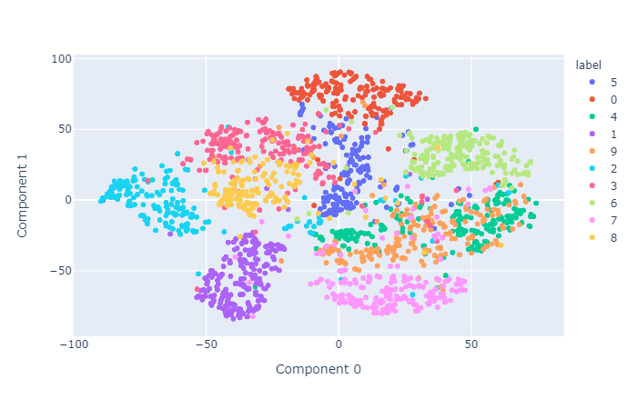
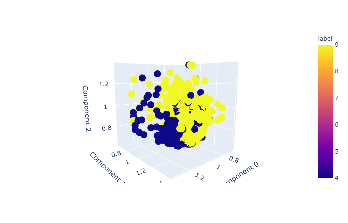

# QML-Variational-Quantum-Classifier
This repo contains code for a quantum machine learning algorithm: Variational Quantum Classifier.

Rendered nbviewer link: [VQC](https://nbviewer.jupyter.org/github/nama-aman/QML-Variational-Quantum-Classifier/tree/master/)

